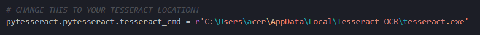

# Sudoku Solver


## Latar Belakang
Anda adalah Mr. Khun, saat ini Anda tergabung bersama tim Sweet & Sour untuk mencapai puncak menara. Agar dapat mencapai puncak menara, ada harus melalui serangkaian tes untuk dapat naik ke lantai selanjutnya. Saat ini Anda berada di lantai 18 dan administrator lantai tersebut, yaitu Mr. Le Leo ingin sekali menguji kecerdasan tim Anda dalam membuat strategi. Area permainan pada lantai ini dibagi menjadi 81 area, berbentuk seperti matriks berukuran 9x9. Setiap area ditandai dengan angka, dalam satu kolom maupun satu baris tidak boleh ada angka berulang (seperti pada permainan sudoku). Untuk lolos dari tes ini, tim Anda harus mengumpulkan kristal yang ada pada area bernomor 5. Anda yang bertugas sebagai light bearer (bertugas mengawasi seluruh area permainan dan memberikan petunjuk serta menyusun strategi untuk seluruh anggota tim). Anda bisa berkomunikasi dengan seluruh anggota dan melihat seluruh area permainan melalui lighthouse, tugas Anda adalah mencari tahu nomor untuk semua area permainan dan memberitahukan koordinat (x,y) area-area yang ditandai dengan nomor 5 kepada anggota tim Anda.


## Spesifikasi

#### Spesifikasi untuk program yang dibuat :
| No | Spesifikasi Program | Jenis |
| ---- | ---- | ---- |
| 1 | Program dibuat dalam bahasa Python | Wajib |
| 2 | Program menerima input berupa file eksternal yang berisi matriks area permainan (disediakan pada repository) dengan lambang '#' yang menandai area belum diketahui nomornya | Wajib |
| 3 | Program melengkapi area-area yang nomornya belum diketahui, strategi dan heuristik yang digunakan dibebaskan dan menjadi salah satu komponen penilaian. **Pencarian solusi harus dibuat sendiri algoritmanya**. | Wajib |
| 4 | Tuliskan hasil dari sepesifikasi (3) pada command prompt/terminal dan simpan dalam file eksternal. Buatlah agar mudah dibaca | Wajib |
| 5 | Tuliskan semua koordinat dari area bernomor 5, tuliskan pada command prompt/terminal dan simpan pada file eksternal yang sama dengan spesifikasi nomor (4). Koordinat dituliskan setelah area permainan | Wajib |
| 6 | Program dapat membaca inputan dari gambar. **Program hanya perlu dapat membaca gambar spesifik yang ada pada repository**. Library yang digunakan dibebaskan dan tidak ada batasan. | Bonus |
| 7 | Program diletakkan pada directory src, kemudian file pengujian diletakkan pada directory test, dan hasil pengujian berupa screenshot diletakkan pada directory result | Wajib |
| 8 | Program dikejakan secara individu, Anda boleh mencari referensi dari manapun namun tidak diperkenankan bekerja sama | Wajib |

## Cara Penggunaan Program
### Prerequisites
1. Python 3
2. OpenCV
```
pip install OpenCV
```
3. imutils
```
pip install imutils
```
4. pytesseract
```
pip install pytesseract
```
### Install tesseract
1. Install tesseract dengan windows installer pada: 
* https://digi.bib.uni-mannheim.de/tesseract/tesseract-ocr-w32-setup-v5.0.0-alpha.20200328.exe (Windows 32 bit)
* https://digi.bib.uni-mannheim.de/tesseract/tesseract-ocr-w64-setup-v5.0.0-alpha.20200328.exe (Windows 64 bit)
(sumber: https://github.com/UB-Mannheim/tesseract/wiki)
2. Perhatikan tesseract path saat instalasi. Path default adalah: C:\Users\USER\AppData\Local\Tesseract-OCR.
3. Ubah script pada file extractImage.py di folder sesuai dengan path instalasi tesseract
<br> <br>
4. Donwload file eng.traineddata dari https://github.com/tesseract-ocr/tessdata/blob/master/eng.traineddata 
5. Tempatkan file tersebut ke direktori  C:\Users\USER\AppData\Local\Tesseract-OCR\tessdata (replace file yang lama).

### Run the Program
1. Buka cmd di folder src
2. Ketikkan perintah berikut untuk menjalankan program utama
```
py main.py
```
3. Pilih menu (1-3)
4. Masukkan file testcase sesuai format yang diminta (.txt atau .png)
5. Hasil akan ditampilkan pada layar cmd sekaligus disimpan pada folder result dalam file .txt

## Strategi Pencarian Solusi
Untuk menyelesaikan Sudoku, algoritma yang dipilih adalah **Backtracking**. Mula-mula akan dicari letak cell kosong pada sudoku.
Lalu coba untuk memasukkan angka antara 1 sampai dengan 9 ke cell teresbut. Jika tidak terdapat angka tersebut pada kolom, baris, dan kotak yang sama, maka lanjutkan pengisian kota kosong selanjutnya. Jika ditemukan jalan buntu, lakukan backtracking untuk kembali ke langkah sebelumnya. Lakukan terus menerus hingga seluruh cell terisi dengan angka.<br>
Kompleksitas Waktu: O(9^(n\*n))<br>
Kompleksitas Ruang: O(n\*n)<br>
Alasan penggunaan algortima backtracking:
* Kompleksitasnya lebih rendah dibanding bruteforce
* Pemilihan angka yang akan diletakkan di cell kosong lebih cerdas dengan memeriksa terlebih dahulu angka-angka di setiap kolom, baris, dan kotak.
* Jika menemui jalan buntu, dapat dilakukan backtracking ke langkah sebelumnya dan mencoba opsi lain, sedangkan
pada bruteforce jika ditemukan jalan buntu, kita harus mengulangi semuanya dari awal.

## Pengerjaan Bonus
Untuk bonus saya menggunakan library openCV, imutils, dan pytesseract. 
* OpenCV digunakan untuk mengekstrasi gambar sudoku. Kelebihan openCV adalah openCV sudah menjadi library yang populer dan banyak digunakan, sehingga cukup mudah untuk mempelajarinya dan fungsi yang disediakannya juga lengkap. Kekurangannya adalah openCV tidak didukung di beberapa bahasa berbasis .NET seperti C# dan Visual Basic.
* imutils digunakan untuk melakukan resize ukuran gambar agar gambar lebih mudah diolah. Kelebihannya adalah mudah instalasi dan digunakan.
* pytesseract untuk mengenali dan mendeteksi angka pada kotak sudoku.
Kelebihannya dengan library ini tidak diperlukan data trainning untuk mesin mempelajari dan mengenali bentuk
dari setiap angka. Kekurangannya adalah set up tesseract cukup menyulitkan dan memakan waktu.

## Referensi
1. https://github.com/aakashjhawar/SolveSudoku
2. https://github.com/KleinSamuel/sudoku-solver


